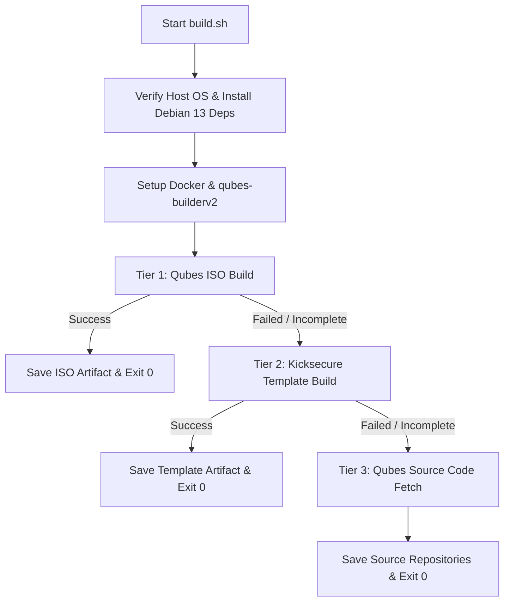

# Qubes Builder v2 User CI (`qubes-builderv2-user-ci`)

This repository provides an automated build system and GitHub Actions CI workflow to build Qubes OS ISOs, Kicksecure Templates, or fetch Qubes source code using **Qubes Builder v2** on **Debian 13 (Trixie)**.

## Key Technical Requirements & Choices

- **Host OS**: Debian 13 / Trixie (supported natively via `build.sh` or in GitHub CI via container `debian:trixie`).
- **Builder System**: [Qubes Builder v2](https://github.com/QubesOS/qubes-builderv2) only. Legacy v1 builder is strictly excluded.
- **No Prebuilt Binaries (`use-qubes-repo`)**: The configuration explicitly omits `use-qubes-repo`. All required Qubes components are fetched and compiled directly from source.
- **GitHub CI**: GitHub Actions provides an objective, reproducible environment for validating Qubes OS build capabilities and identifying upstream documentation or key issues.

## 3-Tiered Fallback Cascade Strategy

Because compiling full Qubes OS ISO components from source without prebuilt binary repositories is highly resource-intensive and prone to missing upstream release keys or build timeouts, `build.sh` implements an automated **3-Tiered Fallback Matrix**:



1. **Tier 1 (Primary Goal)**: Full Qubes ISO build (`./qb installer init-cache fetch prep build`).
2. **Tier 2 (Fallback 1)**: Qubes Kicksecure Template build (`./qb -t kicksecure-18 template fetch prep build`).
3. **Tier 3 (Fallback 2)**: Full Qubes OS source code fetch (`./qb package fetch`).

## Repository Structure

```
qubes-builderv2-user-ci/
├── .github/
│   └── workflows/
│       └── build.yml       # GitHub Actions CI workflow
├── build.sh                 # Main execution script for Debian 13
├── builder-config.yml       # Qubes Builder v2 configuration (No use-qubes-repo)
└── README.md                # Project documentation
```

## How to Run Locally on Debian 13 (Trixie)

1. Clone this repository:
   ```bash
   git clone https://github.com/<your-username>/qubes-builderv2-user-ci.git
   cd qubes-builderv2-user-ci
   ```

2. Make `build.sh` executable and run it:
   ```bash
   chmod +x build.sh
   ./build.sh
   ```

3. Built artifacts (ISO, template packages, or fetched source repos) will be placed in `artifacts/`.

## Reference Documentation

- [Qubes Builder v2 Documentation](https://www.qubes-os.org/doc/qubes-builder-v2/)
- [Qubes Builder v2 GitHub Repository](https://github.com/QubesOS/qubes-builderv2)
- [Qubes ISO Building Documentation](https://doc.qubes-os.org/en/latest/developer/building/qubes-iso-building.html)
